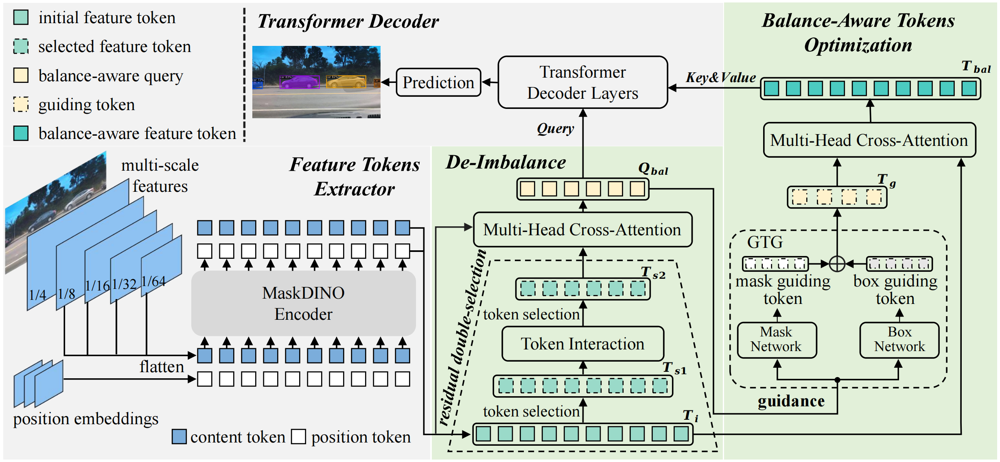

# DI-MaskDINO
This is the official implementation of the paper "DI-MaskDINO: A Joint Object Detection and Instance Segmentation Model". Our code is based on [detectron2](https://github.com/facebookresearch/detectron2).

Authors: Zhixiong Nan, Xianghong Li, Tao Xiang, Jifeng Dai

  

 

## Update
The code for DI-MaskSINO will be released here.

[2024/9] DI-MaskDINO has been accepted at NeurIPS 2024 as a poster!

